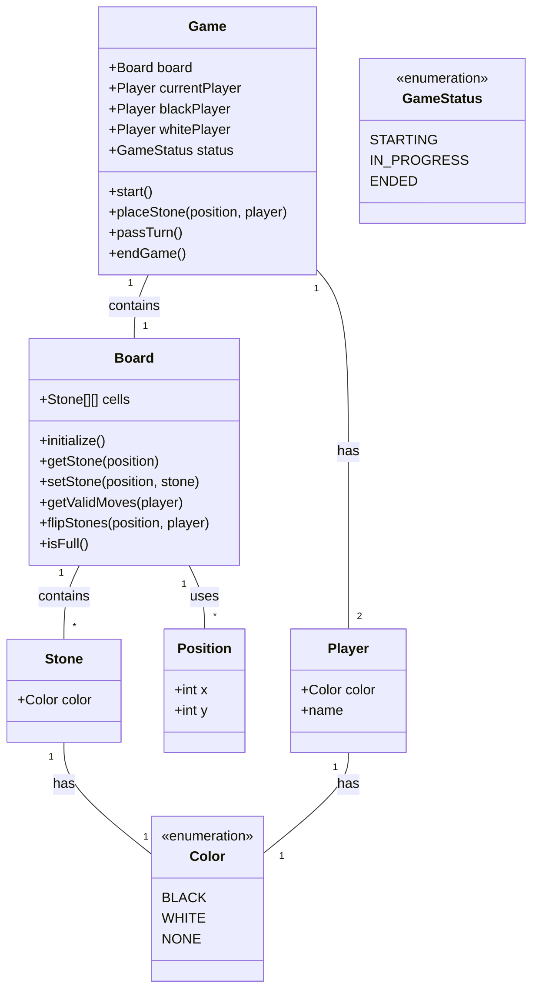

# ドメインモデル

## 概要

オセロゲームのドメインモデルは、以下の主要なエンティティ、値オブジェクト、集約で構成されます。

## ドメインモデル図 (テキストベース)

## 各モデルの詳細

### 集約 (Aggregate)

*   **Game:**
    *   **役割:** オセロゲーム全体のライフサイクルと整合性を管理する集約ルート。
    *   **属性:**
        *   `board`: 現在の盤面状態 (`Board` エンティティ)。
        *   `currentPlayer`: 現在の手番のプレイヤー (`Player` エンティティ)。
        *   `blackPlayer`: 黒のプレイヤー (`Player` エンティティ)。
        *   `whitePlayer`: 白のプレイヤー (`Player` エンティティ)。
        *   `status`: ゲームの現在の状態 (`GameStatus` 値オブジェクト)。
    *   **振る舞い:**
        *   `start()`: ゲームを開始する。
        *   `placeStone(position, player)`: 指定された位置に石を置き、関連するロジック（裏返し、手番の交代など）を実行する。
        *   `passTurn()`: 手番をパスする。
        *   `endGame()`: ゲームを終了し、勝敗を決定する。

### エンティティ (Entity)

*   **Board:**
    *   **役割:** オセロの盤面を表し、石の配置や状態変化を管理する。
    *   **属性:**
        *   `cells`: 8x8のマス目 (`Stone` 値オブジェクトの二次元配列)。
    *   **振る舞い:**
        *   `initialize()`: 盤面を初期状態に設定する。
        *   `getStone(position)`: 指定された位置の石を取得する。
        *   `setStone(position, stone)`: 指定された位置に石を置く。
        *   `getValidMoves(player)`: 指定されたプレイヤーの有効な手をすべて取得する。
        *   `flipStones(position, player)`: 指定された位置に石を置いた結果、裏返る石を処理する。
        *   `isFull()`: 盤面がすべて埋まっているか判定する。

*   **Player:**
    *   **役割:** ゲームの参加者を表す。
    *   **属性:**
        *   `color`: プレイヤーの色 (`Color` 値オブジェクト)。
        *   `name`: プレイヤーの名前。

### 値オブジェクト (Value Object)

*   **Stone:**
    *   **役割:** 盤面上の石の色を表す。
    *   **属性:**
        *   `color`: 石の色 (`Color` 値オブジェクト)。

*   **Position:**
    *   **役割:** 盤面上の特定のマス目の座標を表す。
    *   **属性:**
        *   `x`: X座標 (0-7)。
        *   `y`: Y座標 (0-7)。

*   **GameStatus:**
    *   **役割:** ゲームの現在の状態を表す列挙型。
    *   **属性:** `STARTING`, `IN_PROGRESS`, `ENDED`

*   **Color:**
    *   **役割:** 石またはプレイヤーの色を表す列挙型。
    *   **属性:** `BLACK`, `WHITE`, `NONE` (空のマス用)
